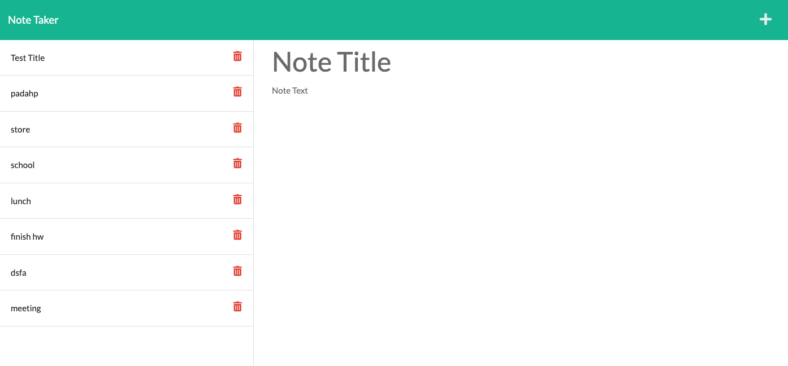

# Note Taker

## Description

This is a note taking application. The user is able to type in information in two separate fields, one for the title, and the other for the content of the note. Once the user clicks the save button, the note is displayed on the left hand side of the screen alongside all other saved notes. Each note is given a unique ID.

-------------------------------

## Table of Contents

1. [Installation](#installation)
2. [Usage Information](#usage)
3. [Contribution Guidelines](#contribution)
4. [Test Instructions](#test)
5. [Questions](#questions)
6. [License](#license)

------------------------------

## Installation 

Type npm install in the command line.

## Usage Information 

This program's intended purpose is to provide a simple application for storing brief notes in an organized way.

## Contribution Guidelines 

* Report any bugs to the email below.
* If your code is complicated, use comments.
* Any major changes must be approved by the repo-manager.
* Be respectful.

## Test Instructions 

Give your note a "Title" and some "text" and click the save button to see the note saved on the left-hand side of the app.

## Screenshot

## Licenses 

* The MIT License

## Questions 

* [GitHub](github.com/3roses) 
* [Email](mailto:cleslie25@gmail.com)
